# MiFiTo 図のギャラリー

SEM、EDX元素マップ、AFM高さ画像の7サンプルを使い、スケールバーとラベルの置き方を比較します。各サンプルに画像内・画像外の2パターンを用意しました。ラベルはパネル記号と補足文字を組み合わせています。

**すべて人工的に生成した模擬画像です。実際の顕微鏡で取得した画像ではありません。** 画素寸法と高さ・計数データを持つモデルから作成し、MiFiToの実際の描画処理でバーとラベルを付けています。

[MiFiToを開く](https://murajun620-crypto.github.io/Microscopy_figure_tools_web/) · [学生向けマニュアル](https://murajun620-crypto.github.io/Microscopy_figure_tools_web/manual/) · [esa掲載用一式](https://murajun620-crypto.github.io/Microscopy_figure_tools_web/gallery/gallery.zip)

## 2つの配置ルール

|配置|スケールバーの個別背景|ラベルの個別背景|文字色|
|---|---|---|---|
|画像内部|あり 半透明黒|あり 半透明黒|白|
|画像外部|なし|なし|黒|

画像外の白い部分は上下に追加した余白です。バーとラベルの個別背景は両方オフにしてあります。画像外ではラベルを上、バーを下に配置しています。

## プロジェクトで再現する

1. 作例の「プロジェクト」をダウンロードする。
2. MiFiToの「プロジェクトを開く」で開く。元画像、校正、バー、ラベル設定が復元される。
3. ラベルと補足文字、個別背景、位置を変更する。

PNGのdpiから画素寸法を推定して校正しないでください。この作例ではモデルに与えたnm/pxを校正値として使っています。実画像は装置の画素寸法や既知長のスケールで校正します。

## SEM Auナノ粒子

### 画像内部 個別背景あり

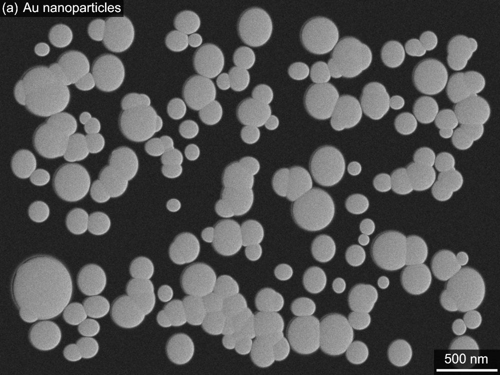

[元画像](https://murajun620-crypto.github.io/Microscopy_figure_tools_web/gallery/data/sem-particles.png) · [プロジェクト](https://murajun620-crypto.github.io/Microscopy_figure_tools_web/gallery/projects/sem-particles-inside.mifito) · [PNG 600 dpi](https://murajun620-crypto.github.io/Microscopy_figure_tools_web/gallery/figures/sem-particles-inside.png) · [SVG](https://murajun620-crypto.github.io/Microscopy_figure_tools_web/gallery/figures/sem-particles-inside.svg)

### 画像外部 個別背景なし

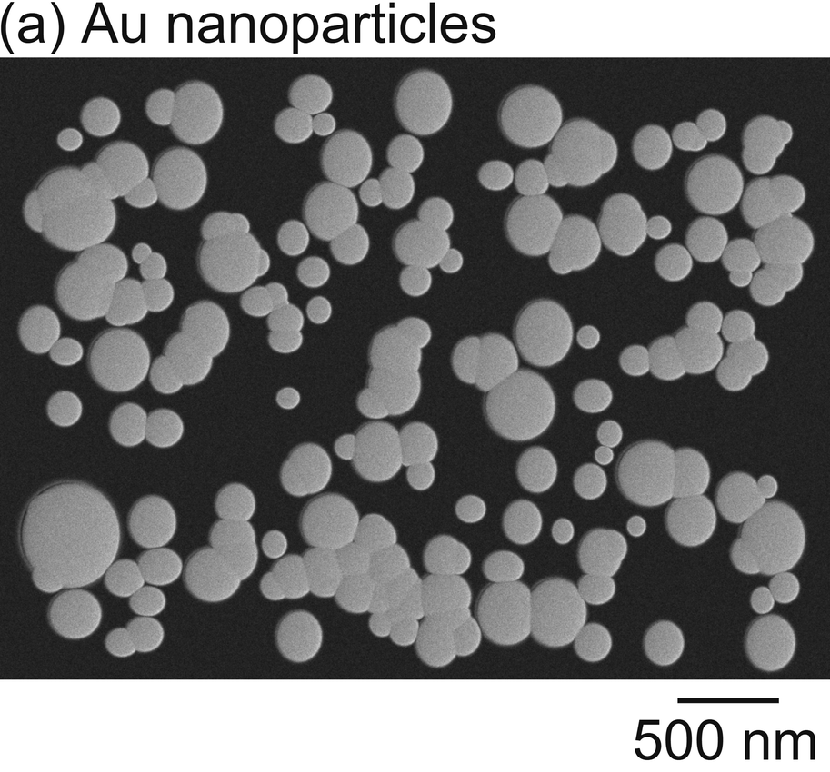

[元画像](https://murajun620-crypto.github.io/Microscopy_figure_tools_web/gallery/data/sem-particles.png) · [プロジェクト](https://murajun620-crypto.github.io/Microscopy_figure_tools_web/gallery/projects/sem-particles-outside.mifito) · [PNG 600 dpi](https://murajun620-crypto.github.io/Microscopy_figure_tools_web/gallery/figures/sem-particles-outside.png) · [SVG](https://murajun620-crypto.github.io/Microscopy_figure_tools_web/gallery/figures/sem-particles-outside.svg)

**校正：** 4 nm/px。バー500 nm = 元画像上125 px。両パターンの走査画像部分の大きさは同じです。

**ラベル：** 「(a)」＋補足文字「Au nanoparticles」。

### 元画像の作り方

対数正規粒径の楕円状粒子を配置し、表面傾斜、明るい縁、照射方向の陰影、計数ノイズを重ねたSEM二次電子像の近似。

1024×768 px、4 nm/px。190個を配置。幾何学的投影径の中央値184 nm、対数標準偏差0.32。重なりあり。実際の電子輸送計算ではない。

二次電子像の表面コントラストと縁の明るさは[JEOLのSEM像解説](https://www.jeol.com/words/semterms/20121024.070958.php)を参考にした近似です。

## SEM 多孔質膜

### 画像内部 個別背景あり

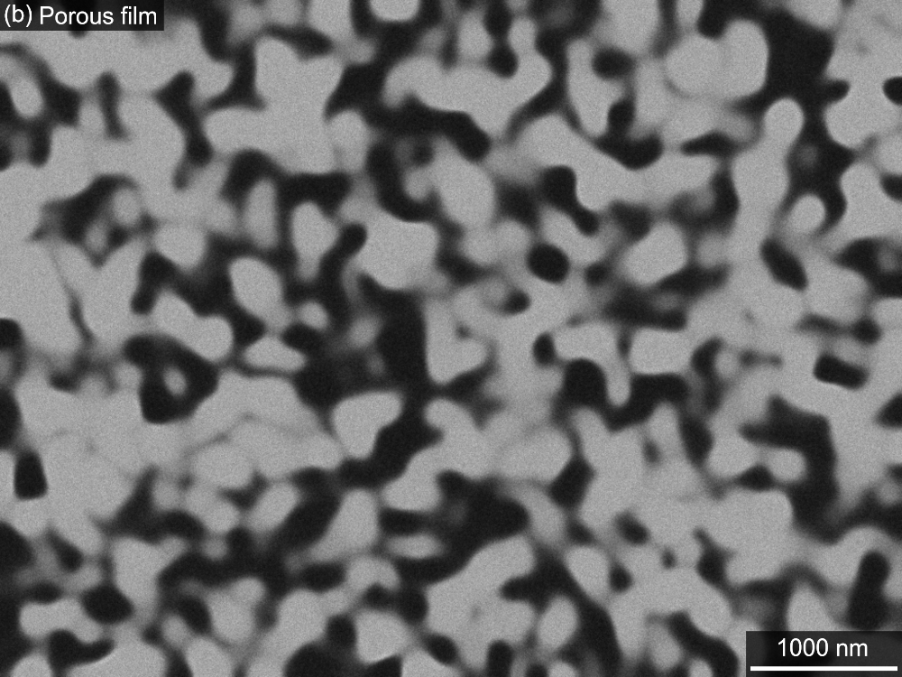

[元画像](https://murajun620-crypto.github.io/Microscopy_figure_tools_web/gallery/data/sem-porous.png) · [プロジェクト](https://murajun620-crypto.github.io/Microscopy_figure_tools_web/gallery/projects/sem-porous-inside.mifito) · [PNG 600 dpi](https://murajun620-crypto.github.io/Microscopy_figure_tools_web/gallery/figures/sem-porous-inside.png) · [SVG](https://murajun620-crypto.github.io/Microscopy_figure_tools_web/gallery/figures/sem-porous-inside.svg)

### 画像外部 個別背景なし

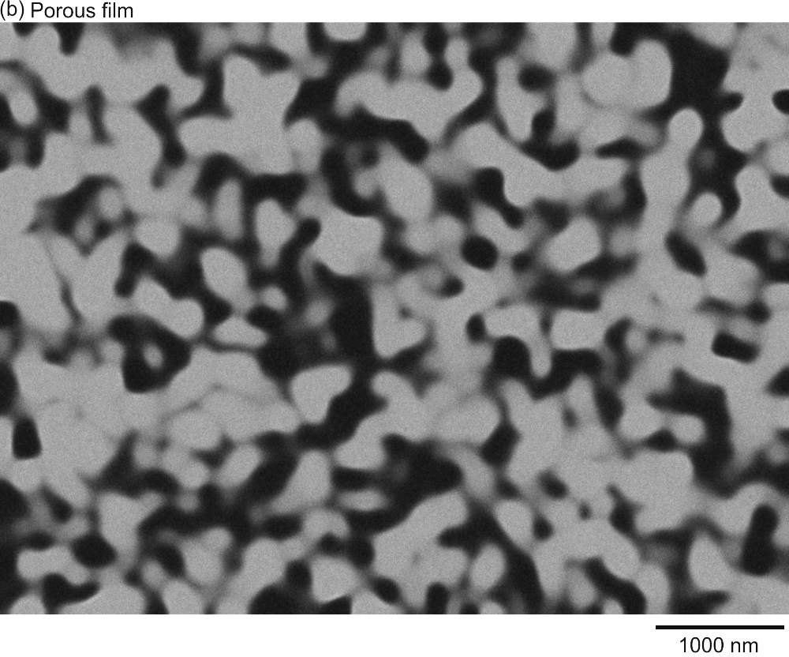

[元画像](https://murajun620-crypto.github.io/Microscopy_figure_tools_web/gallery/data/sem-porous.png) · [プロジェクト](https://murajun620-crypto.github.io/Microscopy_figure_tools_web/gallery/projects/sem-porous-outside.mifito) · [PNG 600 dpi](https://murajun620-crypto.github.io/Microscopy_figure_tools_web/gallery/figures/sem-porous-outside.png) · [SVG](https://murajun620-crypto.github.io/Microscopy_figure_tools_web/gallery/figures/sem-porous-outside.svg)

**校正：** 6 nm/px。バー1000 nm = 元画像上167 px。両パターンの走査画像部分の大きさは同じです。

**ラベル：** 「(b)」＋補足文字「Porous film」。

### 元画像の作り方

空間相関を持つランダム場を閾値化して連続骨格と孔を作り、縁のコントラストと計数ノイズを加えた。

6 nm/px、視野6.144×4.608 µm、相関長の設定78 nm。材料名や実測孔径は割り当てていない。

二次電子像の表面コントラストと縁の明るさは[JEOLのSEM像解説](https://www.jeol.com/words/semterms/20121024.070958.php)を参考にした近似です。

## EDX Auマップ

### 画像内部 個別背景あり

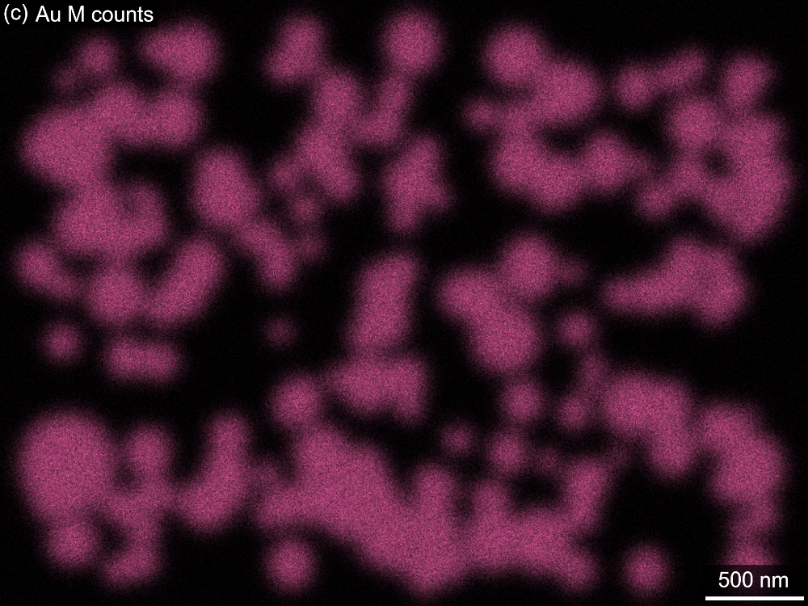

[元画像](https://murajun620-crypto.github.io/Microscopy_figure_tools_web/gallery/data/edx-au.png) · [プロジェクト](https://murajun620-crypto.github.io/Microscopy_figure_tools_web/gallery/projects/edx-au-inside.mifito) · [PNG 600 dpi](https://murajun620-crypto.github.io/Microscopy_figure_tools_web/gallery/figures/edx-au-inside.png) · [SVG](https://murajun620-crypto.github.io/Microscopy_figure_tools_web/gallery/figures/edx-au-inside.svg)

### 画像外部 個別背景なし

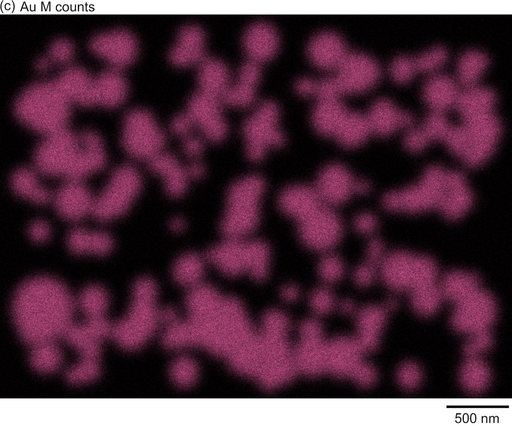

[元画像](https://murajun620-crypto.github.io/Microscopy_figure_tools_web/gallery/data/edx-au.png) · [プロジェクト](https://murajun620-crypto.github.io/Microscopy_figure_tools_web/gallery/projects/edx-au-outside.mifito) · [PNG 600 dpi](https://murajun620-crypto.github.io/Microscopy_figure_tools_web/gallery/figures/edx-au-outside.png) · [SVG](https://murajun620-crypto.github.io/Microscopy_figure_tools_web/gallery/figures/edx-au-outside.svg)

**校正：** 4 nm/px。バー500 nm = 元画像上125 px。両パターンの走査画像部分の大きさは同じです。

**ラベル：** 「(c)」＋補足文字「Au M counts」。

### 元画像の作り方

SEMと同じ粒子配置からAuとSiの期待計数を作り、標準偏差48 nmの空間ぼけとPoisson計数ノイズを加えた。

Auは粒子部分、Siは基板部分が優勢。各色の表示上限はAu 30 counts/px、Si 22 counts/px。別々の表示スケールなので色の明るさを元素間の濃度比較に使わない。

EDXは画素ごとの特性X線計数を表すという[JEOLの元素マッピング解説](https://www.jeol.com/words/semterms/20121024.031359.php)を参考にしました。濃度マップではありません。

## EDX Siマップ

### 画像内部 個別背景あり

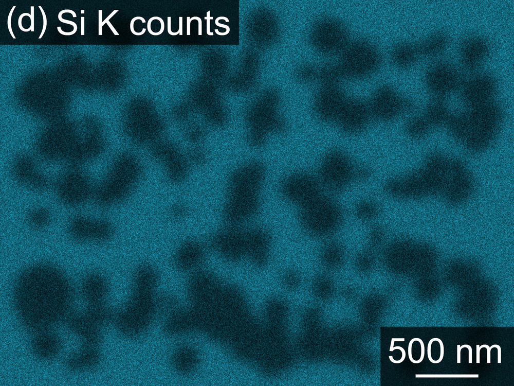

[元画像](https://murajun620-crypto.github.io/Microscopy_figure_tools_web/gallery/data/edx-si.png) · [プロジェクト](https://murajun620-crypto.github.io/Microscopy_figure_tools_web/gallery/projects/edx-si-inside.mifito) · [PNG 600 dpi](https://murajun620-crypto.github.io/Microscopy_figure_tools_web/gallery/figures/edx-si-inside.png) · [SVG](https://murajun620-crypto.github.io/Microscopy_figure_tools_web/gallery/figures/edx-si-inside.svg)

### 画像外部 個別背景なし

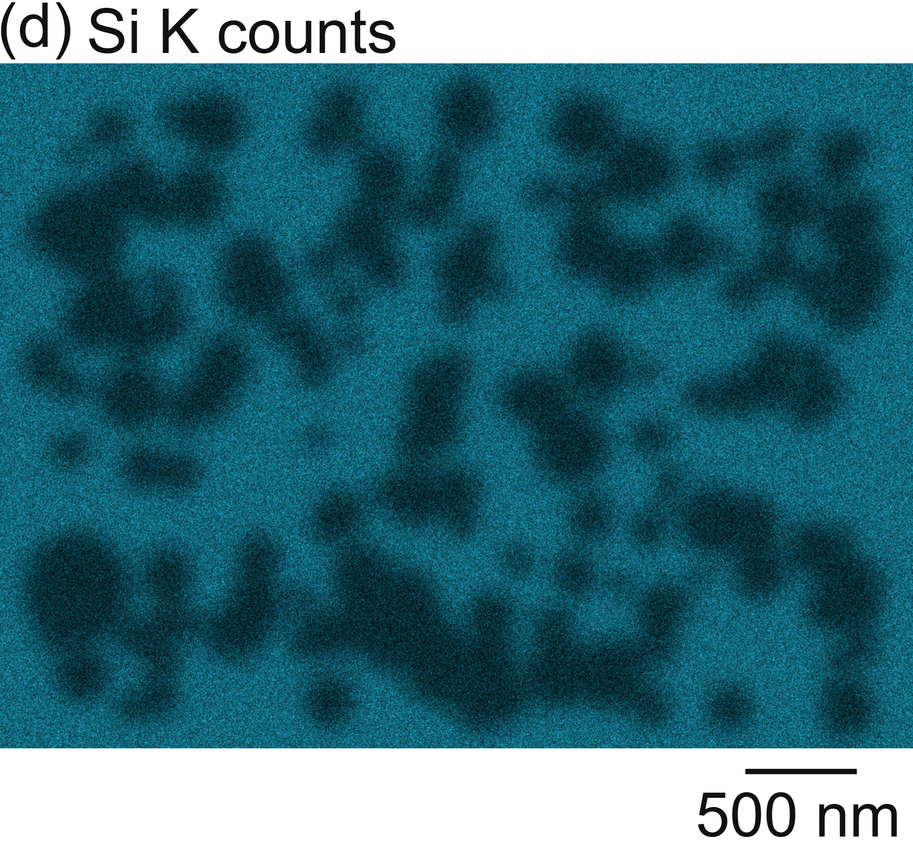

[元画像](https://murajun620-crypto.github.io/Microscopy_figure_tools_web/gallery/data/edx-si.png) · [プロジェクト](https://murajun620-crypto.github.io/Microscopy_figure_tools_web/gallery/projects/edx-si-outside.mifito) · [PNG 600 dpi](https://murajun620-crypto.github.io/Microscopy_figure_tools_web/gallery/figures/edx-si-outside.png) · [SVG](https://murajun620-crypto.github.io/Microscopy_figure_tools_web/gallery/figures/edx-si-outside.svg)

**校正：** 4 nm/px。バー500 nm = 元画像上125 px。両パターンの走査画像部分の大きさは同じです。

**ラベル：** 「(d)」＋補足文字「Si K counts」。

### 元画像の作り方

SEMと同じ粒子配置からAuとSiの期待計数を作り、標準偏差48 nmの空間ぼけとPoisson計数ノイズを加えた。

Auは粒子部分、Siは基板部分が優勢。各色の表示上限はAu 30 counts/px、Si 22 counts/px。別々の表示スケールなので色の明るさを元素間の濃度比較に使わない。

EDXは画素ごとの特性X線計数を表すという[JEOLの元素マッピング解説](https://www.jeol.com/words/semterms/20121024.031359.php)を参考にしました。濃度マップではありません。

## EDX AuとSiの重ね合わせ

### 画像内部 個別背景あり

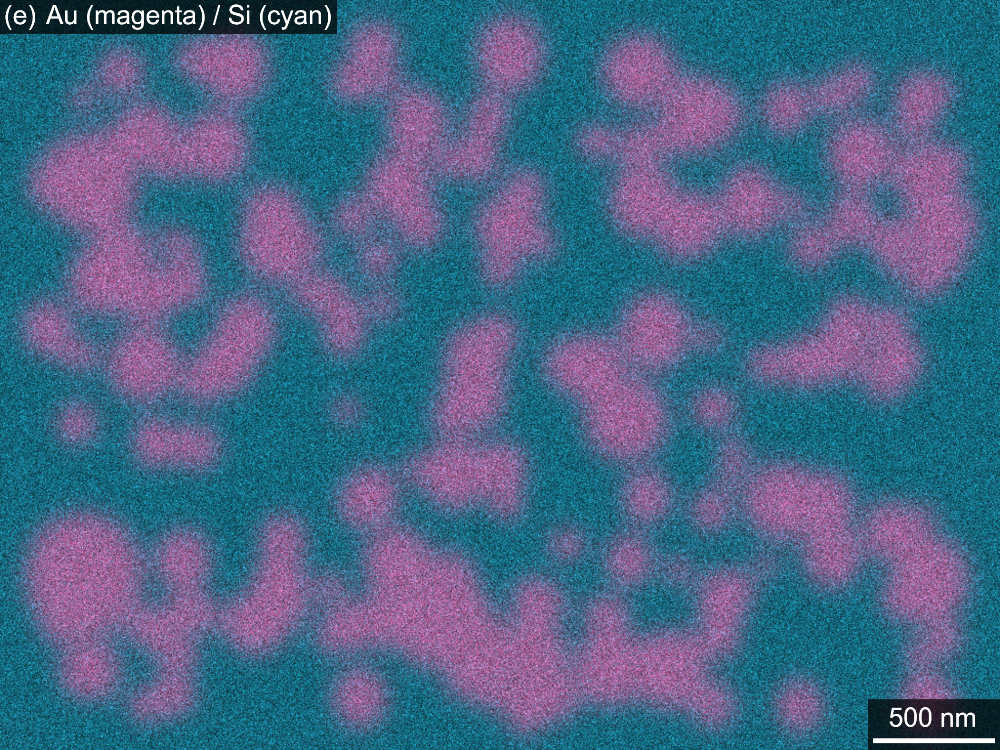

[元画像](https://murajun620-crypto.github.io/Microscopy_figure_tools_web/gallery/data/edx-overlay.png) · [プロジェクト](https://murajun620-crypto.github.io/Microscopy_figure_tools_web/gallery/projects/edx-overlay-inside.mifito) · [PNG 600 dpi](https://murajun620-crypto.github.io/Microscopy_figure_tools_web/gallery/figures/edx-overlay-inside.png) · [SVG](https://murajun620-crypto.github.io/Microscopy_figure_tools_web/gallery/figures/edx-overlay-inside.svg)

### 画像外部 個別背景なし

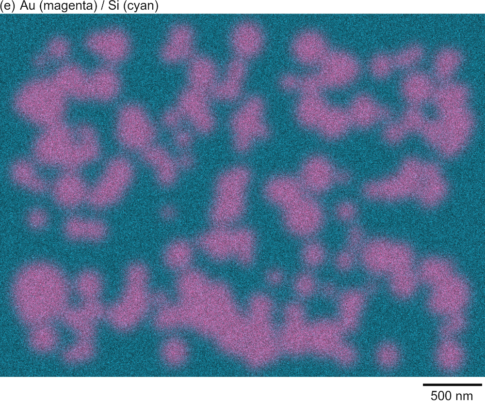

[元画像](https://murajun620-crypto.github.io/Microscopy_figure_tools_web/gallery/data/edx-overlay.png) · [プロジェクト](https://murajun620-crypto.github.io/Microscopy_figure_tools_web/gallery/projects/edx-overlay-outside.mifito) · [PNG 600 dpi](https://murajun620-crypto.github.io/Microscopy_figure_tools_web/gallery/figures/edx-overlay-outside.png) · [SVG](https://murajun620-crypto.github.io/Microscopy_figure_tools_web/gallery/figures/edx-overlay-outside.svg)

**校正：** 4 nm/px。バー500 nm = 元画像上125 px。両パターンの走査画像部分の大きさは同じです。

**ラベル：** 「(e)」＋補足文字「Au (magenta) / Si (cyan)」。

### 元画像の作り方

SEMと同じ粒子配置からAuとSiの期待計数を作り、標準偏差48 nmの空間ぼけとPoisson計数ノイズを加えた。

Auは粒子部分、Siは基板部分が優勢。各色の表示上限はAu 30 counts/px、Si 22 counts/px。別々の表示スケールなので色の明るさを元素間の濃度比較に使わない。

EDXは画素ごとの特性X線計数を表すという[JEOLの元素マッピング解説](https://www.jeol.com/words/semterms/20121024.031359.php)を参考にしました。濃度マップではありません。

## AFM ナノ粒状表面

### 画像内部 個別背景あり

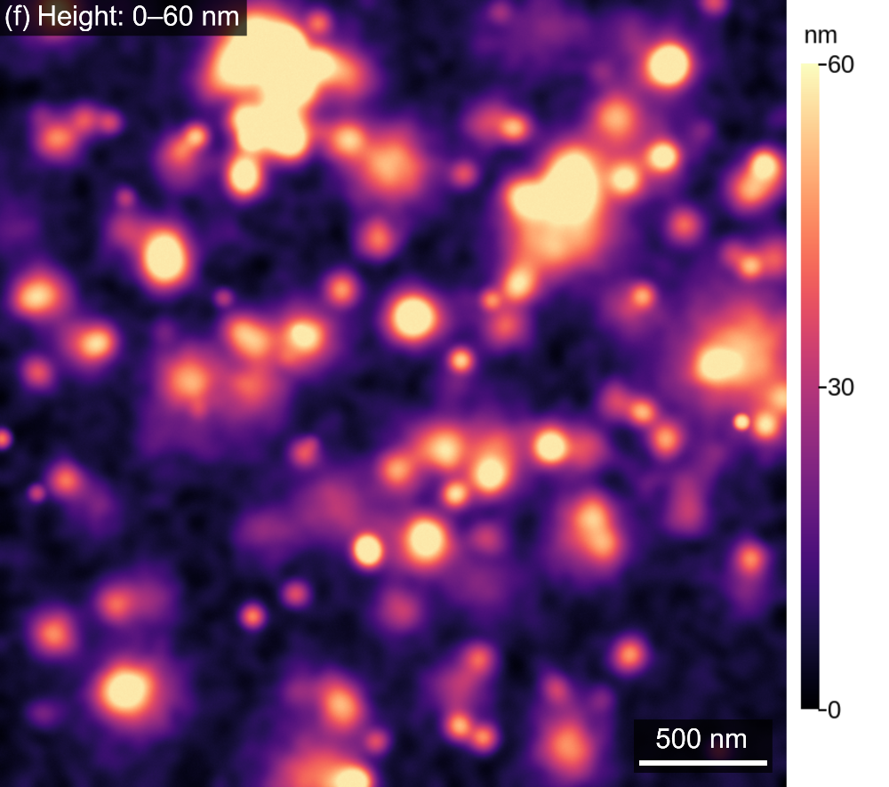

[元画像](https://murajun620-crypto.github.io/Microscopy_figure_tools_web/gallery/data/afm-grains.png) · [プロジェクト](https://murajun620-crypto.github.io/Microscopy_figure_tools_web/gallery/projects/afm-grains-inside.mifito) · [PNG 600 dpi](https://murajun620-crypto.github.io/Microscopy_figure_tools_web/gallery/figures/afm-grains-inside.png) · [SVG](https://murajun620-crypto.github.io/Microscopy_figure_tools_web/gallery/figures/afm-grains-inside.svg)

### 画像外部 個別背景なし

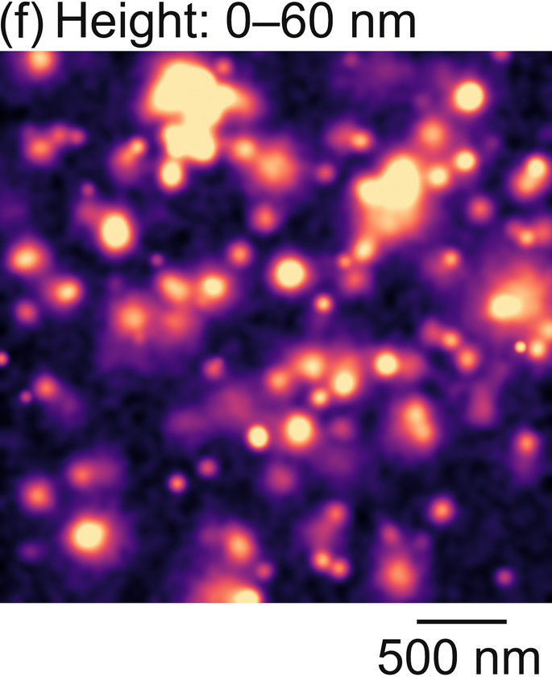

[元画像](https://murajun620-crypto.github.io/Microscopy_figure_tools_web/gallery/data/afm-grains.png) · [プロジェクト](https://murajun620-crypto.github.io/Microscopy_figure_tools_web/gallery/projects/afm-grains-outside.mifito) · [PNG 600 dpi](https://murajun620-crypto.github.io/Microscopy_figure_tools_web/gallery/figures/afm-grains-outside.png) · [SVG](https://murajun620-crypto.github.io/Microscopy_figure_tools_web/gallery/figures/afm-grains-outside.svg)

**校正：** 4 nm/px。バー500 nm = 元画像上125 px。両パターンの走査画像部分の大きさは同じです。

**ラベル：** 「(f)」＋補足文字「Height: 0–60 nm」。

### 元画像の作り方

相関した基板粗さに多数の高さピークを加え、半径12 nmの放物面探針による形態学的膨張と高さノイズを適用した。

データ領域768×768 px、4 nm/px、視野3.072 µm角。右の100 pxは高さカラーバーで、走査領域ではない。カラーマップmagma、共通範囲0–60 nm。

## AFM 段差を持つ表面

### 画像内部 個別背景あり

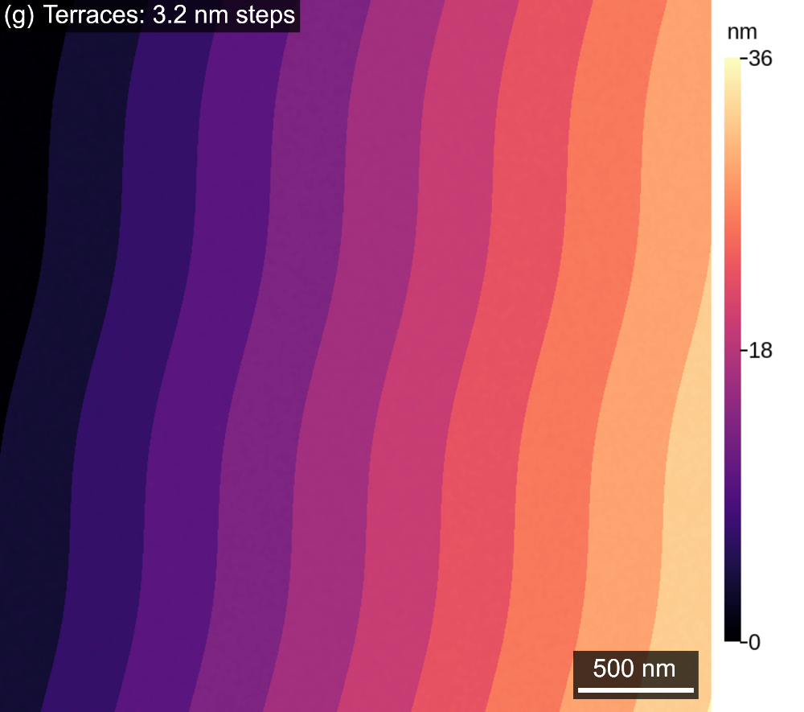

[元画像](https://murajun620-crypto.github.io/Microscopy_figure_tools_web/gallery/data/afm-terraces.png) · [プロジェクト](https://murajun620-crypto.github.io/Microscopy_figure_tools_web/gallery/projects/afm-terraces-inside.mifito) · [PNG 600 dpi](https://murajun620-crypto.github.io/Microscopy_figure_tools_web/gallery/figures/afm-terraces-inside.png) · [SVG](https://murajun620-crypto.github.io/Microscopy_figure_tools_web/gallery/figures/afm-terraces-inside.svg)

### 画像外部 個別背景なし

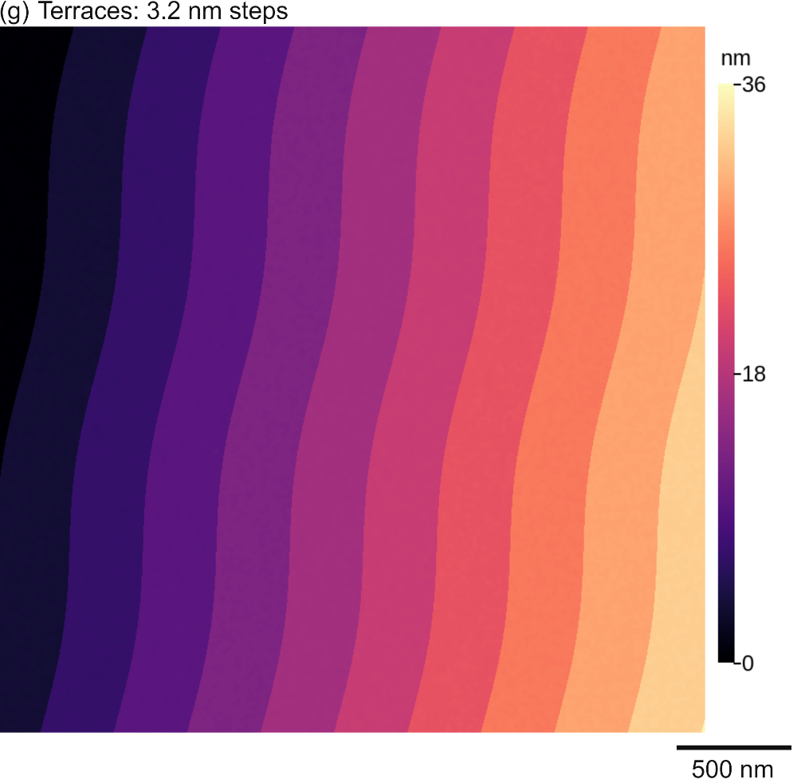

[元画像](https://murajun620-crypto.github.io/Microscopy_figure_tools_web/gallery/data/afm-terraces.png) · [プロジェクト](https://murajun620-crypto.github.io/Microscopy_figure_tools_web/gallery/projects/afm-terraces-outside.mifito) · [PNG 600 dpi](https://murajun620-crypto.github.io/Microscopy_figure_tools_web/gallery/figures/afm-terraces-outside.png) · [SVG](https://murajun620-crypto.github.io/Microscopy_figure_tools_web/gallery/figures/afm-terraces-outside.svg)

**校正：** 4 nm/px。バー500 nm = 元画像上125 px。両パターンの走査画像部分の大きさは同じです。

**ラベル：** 「(g)」＋補足文字「Terraces: 3.2 nm steps」。

### 元画像の作り方

ゆるく曲がった平行テラスに3.2 nmの段差と空間相関した小さな高さノイズを加えた。

データ領域768×768 px、4 nm/px、視野3.072 µm角。高さ表示0–36 nm。右の100 pxは高さカラーバー。ステップは特定結晶の原子層高さを意味しない。

## 補足文字を付けないラベル

SEM粒子像を使った「(a)」のみの例です。上の「(a) Au nanoparticles」と比較できます。

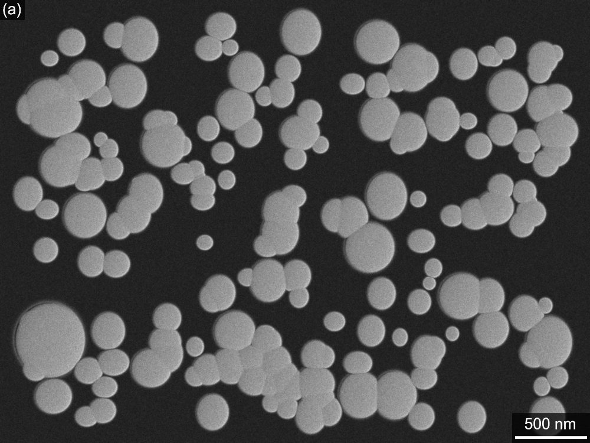

[PNG 600 dpi](https://murajun620-crypto.github.io/Microscopy_figure_tools_web/gallery/figures/sem-label-only.png)

## 数値データと表示の注意点

- [粒子配置と投影径CSV](https://murajun620-crypto.github.io/Microscopy_figure_tools_web/gallery/data/particle_ground_truth.csv)：SEM粒子モデルの真値。画像から測定した結果ではありません。
- [EDX計数データ](https://murajun620-crypto.github.io/Microscopy_figure_tools_web/gallery/data/edx_counts.npz)：AuとSiのPoisson計数配列。色画像は可視化用で、定量濃度を意味しません。
- [AFM高さデータ nm](https://murajun620-crypto.github.io/Microscopy_figure_tools_web/gallery/data/afm_heights_nm.npz)：grainとterraceの高さ配列。NPZは解析用の数値データで、MiFiToに開くときは各PNGを使います。
- [AFM断面CSV](https://murajun620-crypto.github.io/Microscopy_figure_tools_web/gallery/data/afm_line_profiles.csv)：粒状高さマップから抽出した2断面。
- AFMの右端は高さカラーバーで、走査範囲に含めません。横方向の校正は走査領域の4 nm/pxを使います。
- 内部配置の個別背景は不透明度72%。図中文字と線を見やすくする背景です。画像そのものの背景を塗り替える設定ではありません。
- 画像外の余白を除いた画像領域は両パターンで同じ大きさです。PNG 600 dpiは保存時の印刷指定で、元画像の解像度を増やしません。

図中文字は通常書体。保存幅8.9 cm、PNG 600 dpi、SVGは元の画像にベクトルのバーとラベルを重ねて保存しています。[Natureの最終図版ガイド](https://www.nature.com/documents/NRJs-guide-to-preparing-final-artwork.pdf)にあるスケール表示と判読性の方針を参考にしました。

乱数の初期値は20261004。MiFiTo Web v1.1.0の公開版と同じ描画コードを使用し、Canvas互換の描画環境で生成しました。プロジェクトをブラウザで開いた場合、ごく小さなフォント計測差が出ることがあります。
