# MiFiTo 詳細マニュアル

元画像を開き、長さの校正、トリミング、スケールバーとパネルラベルの配置、保存、作業の再開を行う手順です。

[MiFiToを開く](https://murajun620-crypto.github.io/Microscopy_figure_tools_web/) ｜ [最初の操作だけを見る](quick.md)

## 1. 画面と画像を開く操作

PCのブラウザでアプリを開きます。左に画像一覧と設定、右にプレビューが表示されます。設定の見出しはクリックで開閉できます。

「＋ 画像を開く」で元画像を選びます。複数選択や、プレビューへのドラッグ＆ドロップでも開けます。PNG・JPEG・BMP・SVG・TIFFに対応しています。

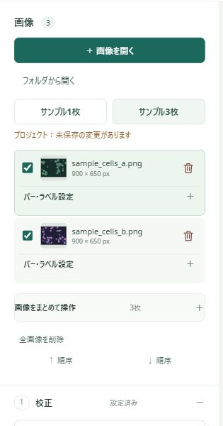

一覧のファイル名、またはプレビュー右上の「‹」「›」で表示画像を切り替えます。画像名の左のチェックは、一括保存の対象です。表示画像を切り替える操作とは役割が違います。

練習には「サンプル3枚」を使います。サンプルは同じサイズ・校正値の模式画像で、最初から校正されています。自分の測定結果として使わないでください。

## 2. 校正の考え方

校正とは、**画像の1 pxが実際の何µmなどに相当するか** を決めることです。正しい長さのスケールバーを描くため、最初に確認します。

| 分かっている情報 | 操作 |
| --- | --- |
| 画像内の基準線の実際の長さ | 両端を測定し、「既知の長さ」と単位を入力する |
| 画像全体の実際の幅・高さ | 「画像幅を使う」「画像高さを使う」で測定し、実際の長さを入力する |
| 撮影情報から分かる1 pxあたりの長さ | 「1 pxあたりの長さ」を入力し、「数値を直接設定」を押す |

例えば、5 µmの線が250 pxなら、`5 ÷ 250 = 0.02 µm/px` です。この校正で2 µmのバーは100 pxに相当します。

**分からない長さを推測して入力しないでください。** 撮影装置の記録や元画像の基準線を確認します。倍率や画素サイズが違う画像では、画像を切り替え、一枚ずつ校正値を確認します。

## 3. 2点を測定して校正する

1. 「↔ 2点を測定」またはプレビュー上部の「↔ 測定」を押します。
2. 既知の長さの基準線の、両端をクリックします。端から端までドラッグしても測れます。
3. 「既知の長さ」と単位を入力します。
4. **「測定から校正」** を押します。
5. 「1 px = …」の値とスケールバーを確認します。

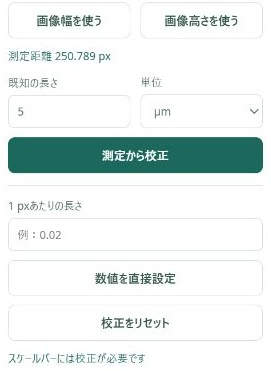

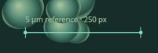

サンプルで練習するときは「校正をリセット」を押し、画像左下の `5 µm reference · 250 px` の線を測り、長さ **5**・単位 **µm** で校正します。

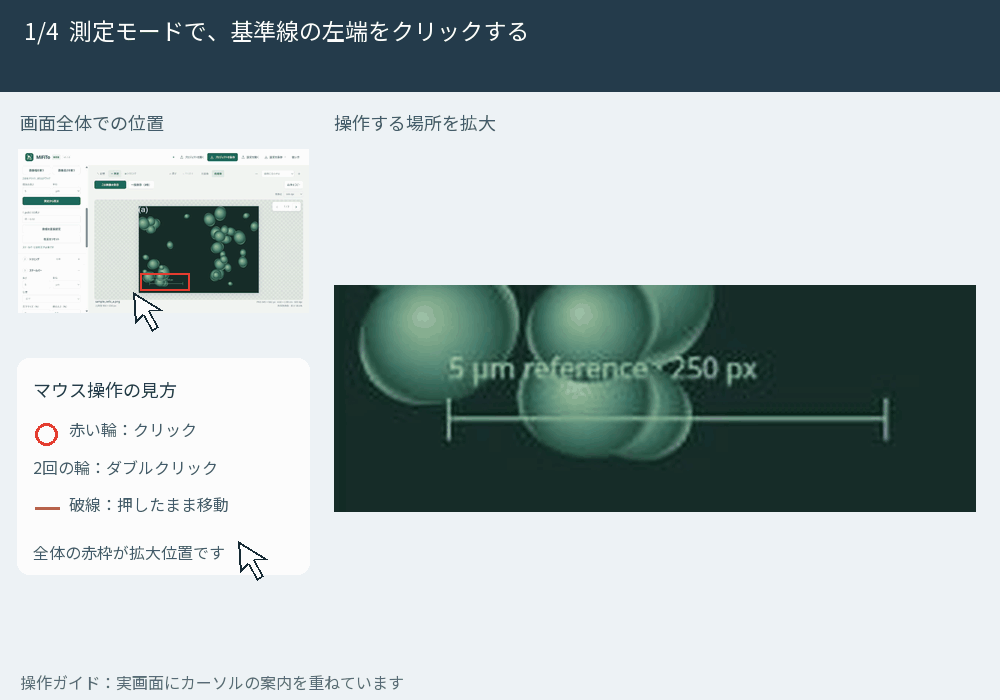

端をマウスで選ぶため、練習では約0.02 µm/pxになれば校正できています。大きく表示すると端を選びやすくなります。やり直すときはEscapeで選択を取り消し、測定し直します。

## 4. トリミングする

「2 トリミング」を開き、縦横比と適用方法を選びます。範囲を確認して **「範囲を適用」** を押します。

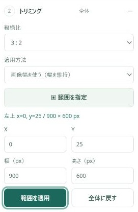

| やりたいこと | 選ぶ設定 |
| --- | --- |
| 幅を保って3：2にそろえる | 縦横比「3：2」・適用方法「画像幅を使う（幅を維持）」 |
| 高さを保ってそろえる | 必要な縦横比・適用方法「画像高さを使う（高さを維持）」 |
| 自由に範囲を切り抜く | 「自由」・「範囲指定した部分」→「範囲を指定」でプレビューをドラッグ |

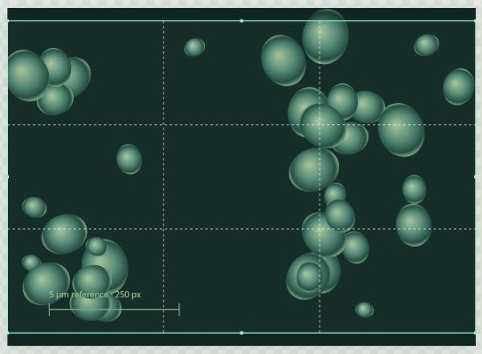

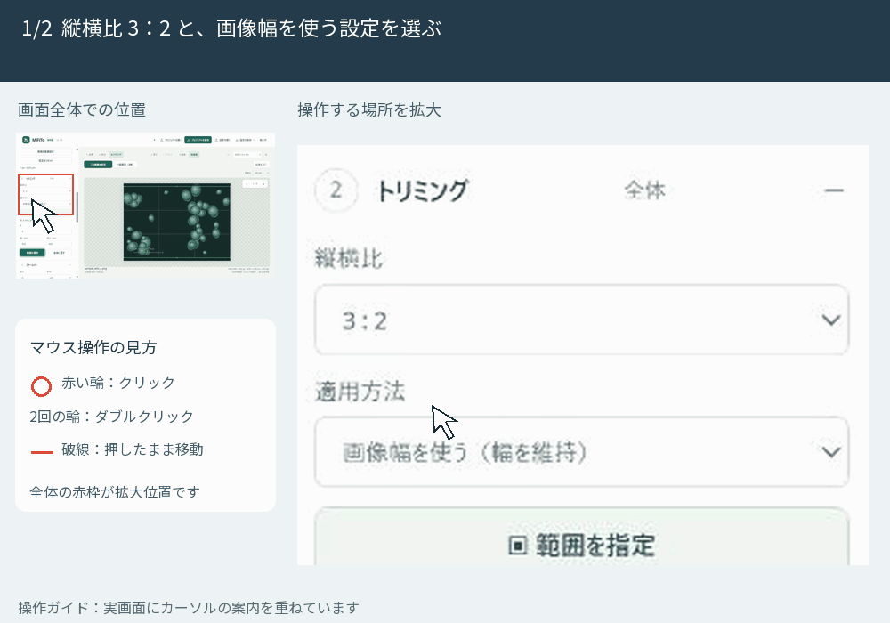

失敗したら「全体に戻す」を押します。「元画像」「処理後」で見比べられます。元の画像ファイルは変更されません。

**トリミング範囲は他の画像にも反映されます。** 保存前に画像を切り替え、必要な部分が残っているか確認してください。

## 5. スケールバーを整える

「3 スケールバー」で、長さ・単位・位置・文字サイズ・太さ・色を設定します。数値は入力後にTabキーや別の項目のクリックで確定します。

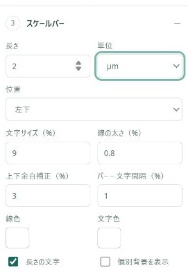

- 暗い画像では白、明るい画像では黒など、読み取れる色にします。
- 画像に重なる場合は「画像外・下中央」などの位置も使えます。
- 「個別背景を表示」で、バーの周囲に背景を付けられます。
- 「長さの文字」のチェックで数値表示を切り替えます。

色の四角を押すと、色パネルが開きます。パネルの色・カラーピッカー・カラーコードから選べます。

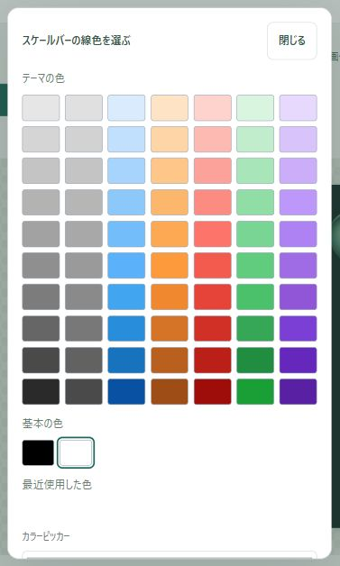

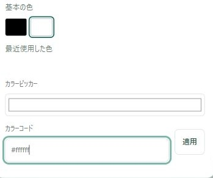

練習では2 µm・左下に変更してみましょう。バーの長さや見た目は他の画像にも反映されますが、校正値は画像ごとに保持されます。同じ2 µmでも、校正値によって必要な画素数が変わります。

サンプルの薄い基準線は元画像に描かれている線です。アプリで追加した大きなスケールバーとは区別してください。

## 6. パネルラベルを付ける

「4 パネルラベル」で形式を選び、連番の例を確認し、**「ラベルを適用」** を押します。選択しただけでは、各画像のラベルは更新されません。

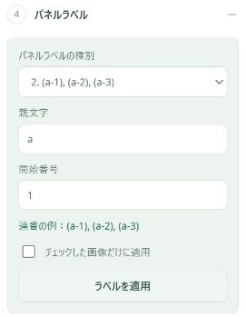

| 形式 | 表示例 |
| --- | --- |
| アルファベット | (a), (b), (c) |
| 枝番号 | (a-1), (a-2), (a-3) |
| 枝ローマ数字 | (a-i), (a-ii), (a-iii) |
| 数字 | (1), (2), (3) |
| カスタム | 必要な連番の形式を指定する |
| なし | ラベルを使わない |

対象を限定する場合は「チェックした画像だけに適用」を使います。適用後は画像を切り替え、順番と文字を確認します。

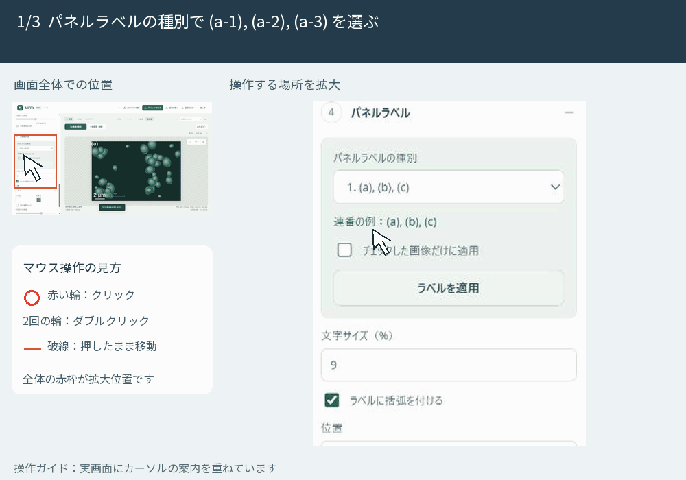

## 7. 個別の表示と位置を調整する

プレビューの **「↖ 配置」** を選び、バーやラベルをドラッグして位置を変えます。画像を拡大したときは、注釈以外の部分をドラッグすると表示位置を移動できます。

画像ごとにバー・ラベルの表示を変えたり、文字を変更したりするときは、左の画像一覧の「バー・ラベル設定」を開きます。共通設定を変えた後は、各画像の表示も確認します。

「↶ 戻す」「↷ やり直す」で直前の操作を戻したり、再適用したりできます。Ctrl＋Z・Ctrl＋Shift＋Z（MacはCmd）も使えます。

## 8. 表示倍率と出力サイズ

| 設定 | 変わるもの |
| --- | --- |
| プレビューの＋・−・表示倍率 | 画面上の見える大きさ |
| 「5 出力」の印刷時のサイズ・指定する辺 | 出力時の幅または高さ（cm） |
| 右上の解像度（dpi） | 保存・コピーする画像の画素数 |

初期の解像度は600 dpiです。提出先の指定があれば合わせます。表示倍率は「画面に合わせる」で戻せます。

dpiを高くしても、元画像の細部が増えるわけではありません。SVG・PDFでも、元の顕微鏡画像部分の情報は元画像に依存します。灰色のチェッカーボードは透明部分を示し、保存画像に模様は入りません。

## 9. 1枚または複数枚を保存する

1枚だけ保存する場合は、画像を表示して **「この画像を保存」** を押します。一括保存では、画像名の左のチェックで対象を選び、**「一括保存（○枚）」** を押します。

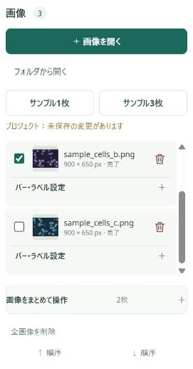

形式と保存先を選び、保存画面の下のボタンを押します。一括保存では対象枚数を必ず確認します。

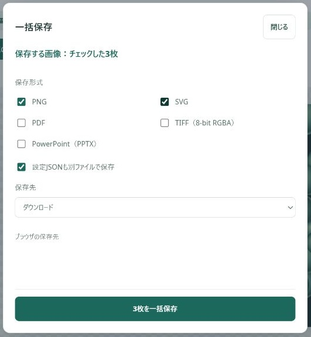

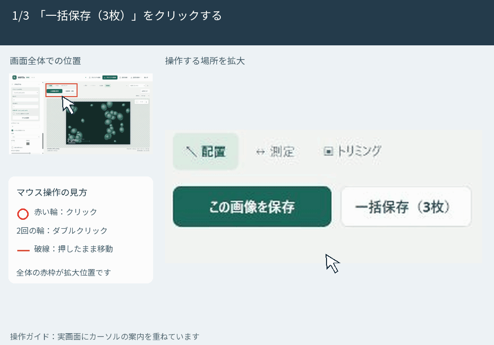

| 形式 | 使い方 |
| --- | --- |
| PNG | レポートやスライドに貼る図 |
| SVG・PDF | 図として配置・共有する。顕微鏡画像部分の画素情報は元画像に依存する |
| TIFF | 指定された提出形式に合わせる。出力は8-bit RGBA |
| PowerPoint（PPTX） | 図を含む新しいファイルとして保存し、保存後に開く |

「設定JSONも別ファイルで保存」にチェックがあると、画像ごとの設定ファイルも出力されます。GIFの例では、3枚についてPNG・SVG・設定JSONの計9ファイルをダウンロードします。ブラウザが複数ダウンロードの許可を求めたら許可します。

出力画像の名前には `_mifito` が付くため、元画像と区別できます。保存後は、出力先やブラウザのダウンロード一覧でファイルを確認します。

## 10. 保存先を選ぶ

| 保存先 | 操作 |
| --- | --- |
| 元ファイルと同じフォルダ | 初回に選択画面が出たら、元画像の入ったフォルダを選ぶ |
| 指定フォルダ | 「保存先を選ぶ」で出力用のフォルダを選ぶ |
| ダウンロード | ブラウザの保存先へ保存する |

「画像を開く」から開いた場合も、元画像と同じフォルダを保存先に選べます。ブラウザから親フォルダを取得できない場合は、初回に選択が必要です。フォルダ選択に対応しないブラウザではダウンロードを使います。

## 11. 画像をコピーする

「画像をコピー」を押し、コピー完了を確認して、Word・PowerPointなどで **Ctrl＋V**（Macは **Cmd＋V**）を押します。右上の解像度がコピーにも使われます。許可を求められたらクリップボードの使用を許可します。

コピーできない場合はPNGを保存し、貼り付け先の「画像を挿入」から使います。開いているPowerPointへの直接送信は行いません。

## 12. プロジェクトを保存して再開する

上部の **「プロジェクトを保存」** で、元画像と編集状態を一つの `.mifito` ファイルに保存します。次回は「プロジェクトを開く」で選びます。

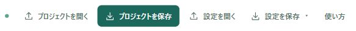

プロジェクトには一覧の元画像、校正、トリミング、ラベル、並び順、処理対象などが保存されます。戻す・やり直すの履歴と、保存先フォルダの権限は再開後に引き継がれません。

PNG保存やコピーだけでは、プロジェクト保存済みにはなりません。自動保存ではないので、終了前にプロジェクトも保存します。更新・終了時に未保存の確認が出たら、キャンセルして保存してください。

## 13. 設定だけを保存して使い回す

「設定を保存」のメニューには、**「この画像の設定を保存」** と **「一覧の設定を保存」** があります。どちらも元画像は含みません。

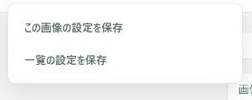

再利用するときは、元画像を先に開いてから「設定を開く」でJSONを選びます。元画像も含めて再開したいときは、プロジェクト保存を使います。

## 14. うまくいかないとき

| 症状 | 確認すること |
| --- | --- |
| バーが出ない | 校正済みか、画像ごとのバー表示がオンか |
| バーの長さが違う | 既知の長さ、単位、画像ごとの校正値 |
| ラベルが更新されない | 「ラベルを適用」を押したか |
| 一括保存の枚数が違う | 画像名の左のチェック |
| 他の画像も切り抜かれた | トリミングは共通反映。各画像を確認し、必要なら「全体に戻す」 |
| バーやラベルが動かない | 「↖ 配置」を選んでいるか |
| 画面が大きすぎる | 表示倍率を「画面に合わせる」にする |
| TIFFの見え方が変わった | 最初のページを表示用の8 bitに変換する。16 bitや多ページの原データは元ファイルを保持する |
| 再開できない | 完成図ではなく `.mifito` を「プロジェクトを開く」で選んだか |

## 練習の確認

- [ ] 画像を切り替え、保存対象を選べる
- [ ] 基準線を測り、既知の長さで校正できる
- [ ] 各画像の校正とトリミング範囲を確認できる
- [ ] スケールバーとパネルラベルを設定できる
- [ ] 1枚保存・一括保存・画像コピーを使い分けられる
- [ ] 完成図とプロジェクトを保存できる

画面はMiFiTo Web v1.1.0です。2026年10月4日更新。
